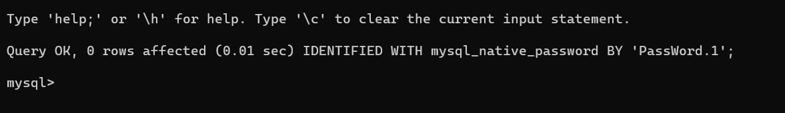

# DOCUMENTATION ON INSTALLING APACHE USING UBUNTU PACKAGE MANAGER PROJECT 1

## INSTALLING APACHE AND UPDATING THE FIREWALL

`sudo apt update`

`sudo apt install apache2`

`sudo systemctl status apache2`

`curl http://127.0.0.1:80`

[accessing url](http://13.51.204.106/)

`curl -s http://169.254.169.254/latest/meta-data/public-ipv4`

## INSTALLING MYSQL

`sudo apt install mysql-server`

`sudo mysql`

`ALTER USER 'root'@'localhost' IDENTIFIED WITH mysql_native_password BY 'PassWord.1';`

`mysql> exit`

`sudo mysql_secure_installation`

`sudo mysql -p`

`mysql> exit`

## INSTALLING PHP

`sudo apt install php libapache2-mod-php php-mysql`

`php -v`

##  DOCUMENTATION ON CREATING A VIRTUAL HOST FOR YOUR WEBSITE USING APACHE 

`sudo mkdir /var/www/projectlamp`

`sudo chown -R $USER:$USER /var/www/projectlamp`

`sudo vi /etc/apache2/sites-available/projectlamp.conf`

`<VirtualHost *:80>
    ServerName projectlamp
    ServerAlias www.projectlamp 
    ServerAdmin webmaster@localhost
    DocumentRoot /var/www/projectlamp
    ErrorLog ${APACHE_LOG_DIR}/error.log
    CustomLog ${APACHE_LOG_DIR}/access.log combined
</VirtualHost>`

`sudo ls /etc/apache2/sites-available`

`sudo a2ensite projectlamp`

`sudo a2dissite 000-default`

`sudo apache2ctl configtest`

`sudo systemctl reload apache2`

`sudo echo 'Hello LAMP from hostname' $(curl -s http://169.254.169.254/latest/meta-data/public-hostname) 'with public IP' $(curl -s http://169.254.169.254/latest/meta-data/public-ipv4) > /var/www/projectlamp/index.html`

[testing virtual host](http://13.51.204.106/)

## ENABLE PHP ON THE WEBSITE PROJECT 1

`sudo vim /etc/apache2/mods-enabled/dir.conf`

`<IfModule mod_dir.c>
        #Change this:
        #DirectoryIndex index.html index.cgi index.pl index.php index.xhtml index.htm
        #To this:
        DirectoryIndex index.php index.html index.cgi index.pl index.xhtml index.htm
</IfModule>`

`sudo systemctl reload apache2`

`vim /var/www/projectlamp/index.php`

`<?php
 phpinfo();`

 `sudo rm /var/www/projectlamp/index.php`
